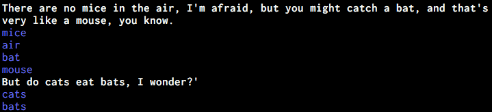

# Alice and RabbitMQ

An example using [RabbitMQ](https://www.rabbitmq.com/) to demonstrate Remote Procedure Call (RPC).  I've developed a basic tool to identify nouns using Alice in Wonderland and `nltk`.  This involves a client and a scalable RPC server, where the `call` method in the `AliceRpcClient` class sends an RPC request to find the nouns in each sentence, blocking until it receives the nouns.  It's then printed to the terminal, with some delay to aid the user.

### To run:

`python rpc_server.py`

`python rpc_client.py`

You can access the management page locally here: [http://localhost:15672](http://localhost:15672)
